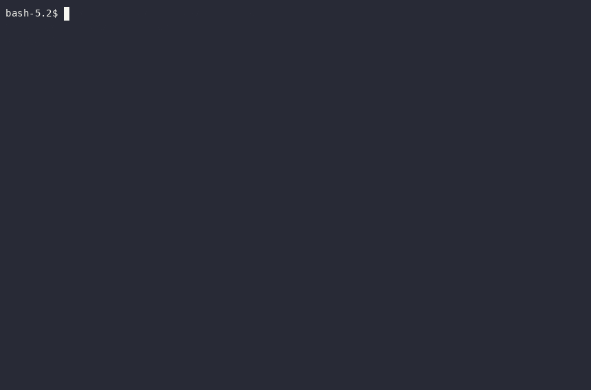
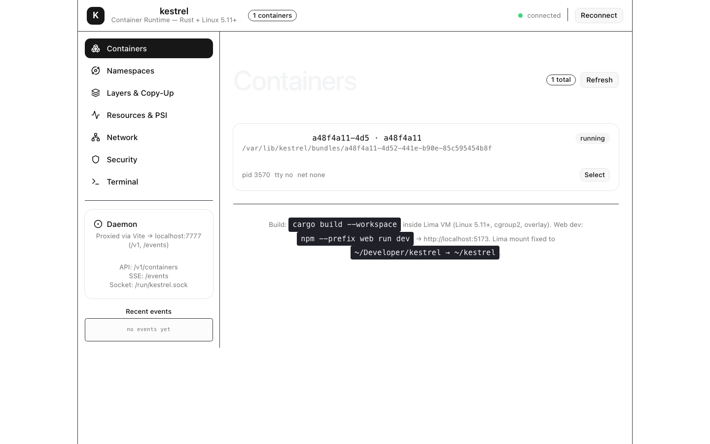
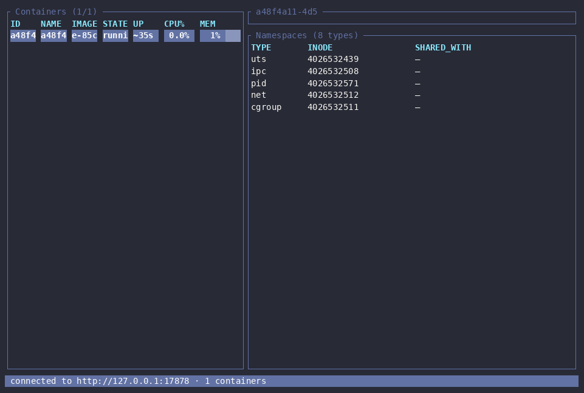

# Kestrel — Container Runtime from Scratch

[](https://github.com/sanskarpan/kestrel/actions/workflows/ci.yml)
[](LICENSE)

**Kestrel** is a from-scratch OCI container runtime, image store, and daemon built in Rust. It implements all 8 Linux namespaces, cgroups v2, OverlayFS, and NAT networking without shelling out — the educational counterpoint to `runc` that shows *why* containers work at the kernel level.

> **Status:** All 328 `CHECKLIST.md` tasks across Phases 0–14 complete and verified (runtime → daemon → CLI/TUI/dashboard + privileged integration suite). See `CHECKLIST.md` and `SPEC.md` for the full roadmap.



| Dashboard (live container) | TUI (ratatui) |
|---|---|
|  |  |

---

## Why Rust (not Go)

`runc` is Go with ~1000 lines of C (`nsexec.c`) that runs *before* the Go runtime boots, because `setns`/`unshare` require a single-threaded process and Go spawns threads before `main()`.

Rust has no runtime threads — `unshare(CLONE_NEWUSER)` just works, every raw syscall is an auditable `unsafe` block, and memory safety matters when you run as root with `CAP_SYS_ADMIN`. `youki` proved this path production-viable.

* **Runtime (`kestrel-runtime`, `kestrel-init`)** — strictly single-threaded, no `tokio`. `fork`/`unshare`/`clone3` via `nix`/`libc`/`rustix`.
* **Daemon (`kestreld`)** — `tokio` + `axum`, `fork+exec`s the runtime (never linked) to preserve the single-thread invariant.
* **Frontend** — `ratatui` TUI + React 18 + Vite + Tailwind + D3/Recharts + xterm.js.

---

## Architecture

```
                  ┌──────────────┐        ┌──────────────┐
                  │   Web UI     │        │     TUI      │
                  │ React+D3     │        │  ratatui     │
                  └──────┬───────┘        └──────┬───────┘
                         │ REST + SSE             │ Unix socket
                         └───────────┬────────────┘
                                     ▼
                          ┌────────────────────┐
                          │    kestreld        │  tokio + axum
                          │  ┌──────────────┐  │  :7777 + /run/kestrel.sock
                          │  │  registry    │  │  container map + events
                          │  │  metrics 1Hz │◄─┼── cgroup stats + PSI
                          │  │  image mgr   │  │
                          │  └──────┬───────┘  │
                          └─────────┼──────────┘
                                    │ fork + exec (never linked)
                                    ▼
                          ┌────────────────────┐
                          │ kestrel-runtime    │  SINGLE-THREADED, no async
                          │ create/start/kill  │  OCI lifecycle: creating → created → running → stopped
                          │ + exec/pause/…     │
                          └─────────┬──────────┘
                                    │ clone3 / unshare / setns
                          ┌─────────▼──────────┐
                          │  kestrel-init PID1 │  static binary (-C target-feature=+crt-static)
                          │  mounts→pivot_root │  reaps zombies, forwards signals
                          │  caps→seccomp→exec │  blocks on exec.fifo between create/start
                          └─────────┬──────────┘
                                    ▼
                             container process

  Libraries (used by runtime + daemon):
    kestrel-oci      OCI spec types, validation, default spec
    kestrel-ns       namespaces, id-maps, three-stage dance, pin/join
    kestrel-cgroup   cgroups v2 manager, PSI, clone_into_cgroup
    kestrel-rootfs   snapshotter, overlay mount, pivot_root, masked/RO paths
    kestrel-security caps (5 sets), no_new_privs, seccomp, rlimits
    kestrel-net      netns, bridge/veth (rtnetlink), IPAM, NAT, DNS
    kestrel-image    content store, registry client, layer extraction
```

**Supporting doc:** `SPEC.md` §3 is the canonical architecture reference.

---

## Quickstart

### Prerequisites

* **Linux ≥ 5.11**, cgroup **v2 unified** (`statfs /sys/fs/cgroup` → `CGROUP2_SUPER_MAGIC`), `overlay` in `/proc/filesystems`
* Rust 1.75+, `pkg-config`, `libseccomp-dev`, `iptables` (nf_tables), `iproute2`
* For rootless: `newuidmap`/`newgidmap` + `/etc/subuid`/`subgid`

### With Lima VM (recommended)

```bash
# 1. Start the VM (vz, aarch64, 4CPU/8GiB) — mounts ./ as ~/kestrel inside
make vm-up          # limactl start .lima/kestrel.yaml
make vm-ssh         # limactl shell kestrel  →  cd ~/kestrel

# Inside the VM:
make build          # cargo build --workspace
make test           # cargo test --workspace          (unprivileged)
make test-root      # sudo -E cargo test --workspace -- --ignored --test-threads=1
make build-kestrel-init-static
```

### Without VM (native Linux host, must be cgroup v2 + root)

```bash
cargo build --workspace
cargo test --workspace
sudo -E cargo test --workspace -- --ignored --skip test_join_order_matters --test-threads=1
cd web && npm ci && npm run build
```

### 30-second first container (native Linux, as root)

```bash
sudo ./target/debug/kestreld &                      # :7777 + /run/kestrel.sock
curl -s -X POST localhost:7777/containers \
  -H 'content-type: application/json' \
  -d '{"image":"alpine:latest","cmd":["/bin/echo","hello-from-kestrel"]}' | tee /tmp/c.json
ID=$(python3 -c "import json;print(json.load(open('/tmp/c.json'))['id'])")
curl -s -X POST localhost:7777/containers/$ID/start
curl -s localhost:7777/containers/$ID/logs          # expect: hello-from-kestrel
```

The full guided version (pull → run → exec → stats → cleanup) lives in
`docs/USER_GUIDE.md`, with troubleshooting in `docs/FAQ.md`.

### How Kestrel compares

|  | `runc` | `youki` | **kestrel** |
|---|---|---|---|
| Language | Go (+ C `nsexec`) | Rust | Rust (runtime is `tokio`-free, single-threaded) |
| Namespaces / cgroups / OverlayFS | yes | yes | yes (all 8 ns, cgroup v2, OverlayFS) |
| Image pull + registry | no (needs external tooling) | no | yes (Docker Hub client built in) |
| Daemon + REST/SSE API | no | no | yes (`kestreld`: metrics, events, introspection) |
| CLI / TUI / web dashboard | CLI only | CLI only | all three (ratatui + React/D3/xterm.js) |
| Goal | production standard | production Rust runtime | **education**: every layer from scratch, fully traced |
| Production use | yes | emerging | **no** — learning/reference implementation (see `docs/SECURITY.md` gaps) |

### CLI / Daemon

```bash
cargo run -p kestreld            # :7777 + /run/kestrel.sock
cargo run -p kestrel-cli -- --help
cargo run -p kestrel-tui         # lazydocker-style TUI
cd web && npm run dev            # Vite proxies /v1 and /events → :7777
```

---

## Workspace Layout

```
crates/
  kestrel-oci        # OCI spec types
  kestrel-ns         # namespace dance (Stage 0/1/2)
  kestrel-cgroup     # cgroup v2 + PSI + clone3
  kestrel-rootfs     # overlay snapshotter + pivot_root
  kestrel-security   # caps + seccomp + no_new_privs
  kestrel-net        # netns/bridge/veth/IPAM/NAT
  kestrel-image      # content store + registry pull
  kestrel-runtime    # OCI runtime binary (create/start/…)
  kestrel-init       # PID 1 (static)
  kestreld           # daemon (axum + SSE)
  kestrel-cli        # CLI (clap)
  kestrel-tui        # TUI (ratatui)
web/                 # React dashboard (TanStack, D3, Recharts, xterm.js)
profiles/seccomp/    # default seccomp profile (~44 denied syscalls)
docs/
  NAMESPACES.md  CGROUPS.md  OVERLAY.md  SECURITY.md
```

---

## ⚠️ VM Warning — Do Not Develop on Your Host

> **A bad `pivot_root` or `umount` can wedge the host.**
> `kestrel-rootfs` and `kestrel-runtime` call `mount --make-rprivate`, `pivot_root(".", ".")`, and `umount2(MNT_DETACH)` against a merged overlay. A bug can leak mounts into the host namespace or detach `/` — recoverable only by reboot (and on bare metal, potentially requiring rescue media).

**Always use the disposable Lima VM** (`make vm-up` / `make vm-ssh`). It is defined in `.lima/kestrel.yaml` (vz, Ubuntu 24.04, aarch64, 40 GiB disk backed by `~/.cache/kestrel-lima/`). The repo is mounted at `~/kestrel` (and legacy `~/Container-Runtime`). The VM disables `kernel.apparmor_restrict_unprivileged_userns` so `CLONE_NEWUSER` works unprivileged, and auto-loads `br_netfilter`.

If you must run natively, snapshot first (`limactl stop` or host snapshot) and never run `cargo test --workspace -- --ignored` without `--test-threads=1`.

---

## Further Reading

* `SPEC.md` — full kernel-by-kernel spec (namespaces → init → daemon API → frontend)
* `docs/NAMESPACES.md` — three-stage dance with diagram
* `docs/CGROUPS.md` — v2, controllers, PSI
* `docs/OVERLAY.md` — layer model, whiteouts, copy-up
* `docs/SECURITY.md` — caps, seccomp, threat model
* `docs/superpowers/specs/*.md` — per-phase design docs
* `CHECKLIST.md` — 328 tasks across 14 phases
* `PROMPT.md` — original project prompt

---

## Contributing

PRs welcome — start with `CONTRIBUTING.md` (Lima VM workflow, quality gates).
Report security issues privately per `SECURITY.md`.

## License

MIT — see [LICENSE](LICENSE).
